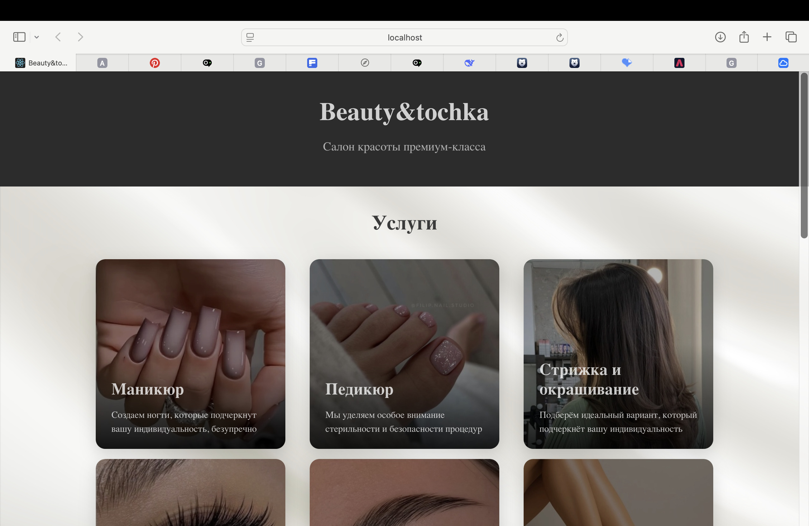

## Описание проекта

Этот проект представляет собой библиотеку React компонентов для салона красоты и демонстрационное приложение, показывающее их использование. Проект разделен на две основные части:

ui-library/ - библиотека переиспользуемых React компонентов для салона красоты
frontend/ - демонстрационное приложение с примерами использования компонентов

## Технологии

- React 18+ с TypeScript
- Vite для сборки
- Jest + Testing Library для тестирования
- ESLint для линтинга
- CSS Modules для стилизации

## Компоненты библиотеки

### 1. ServiceCard

Карточка услуги салона красоты:
- Изображение услуги
- Название и описание
- Поддержка выбора услуги
- Адаптивный дизайн

### 2. MasterPhotoCard

Карточка мастера с фотогалереей:
- Фото мастера
- Интерактивный слайдер работ
- Имя, должность и опыт работы мастера
- Hover-эффекты

## Инструкция по запуску

### Предварительные требования

- Node.js 18+
- npm

### Установка и запуск

1. Клонирование репозитория

git clone <repository-url>
cd student-19

2. Установка зависимостей и запуск UI Library

cd ui-library
npm install
npm run build

3. Запуск демо-приложения

cd ../frontend
npm install
npm run dev

4. Открытие в браузере
Приложение будет доступно по адресу: http://localhost:3000

## Скрипты проекта

### UI Library (ui-library/)

npm run build - сборка библиотеки
npm run dev - разработка с вотчером
npm run test - запуск тестов
npm run lint - проверка кодстайла
npm run test:coverage - запуск тестов с генерацией отчета о покрытии кода

### Frontend (frontend/)

npm run dev - запуск dev-сервера на порту 3000
npm run build - сборка для production
npm run test - запуск тестов
npm run lint - проверка кодстайла

## Примеры работы приложения:

